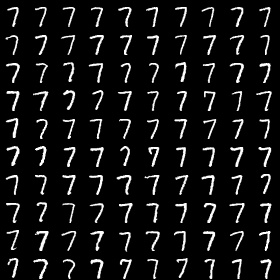
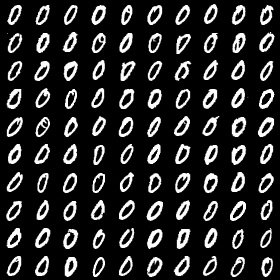
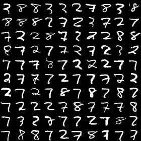
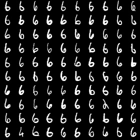
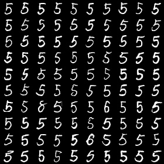

A simple CBIR demo implements by pytorch. Refer to[autoencoders-for-content-based-image-retrieval-with-keras-and-tensorflow/](https://www.pyimagesearch.com/2020/03/30/autoencoders-for-content-based-image-retrieval-with-keras-and-tensorflow/)

## result

